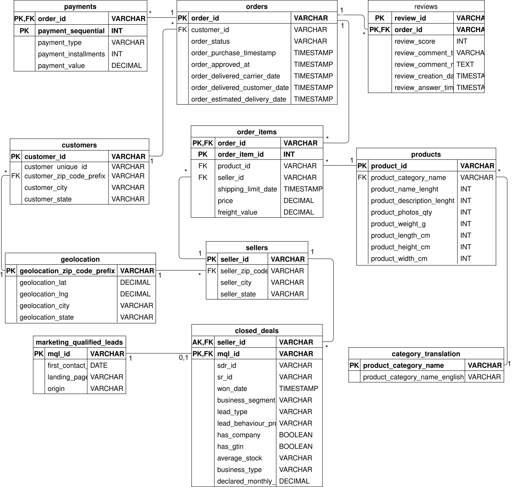

# Olist E-Commerce NoSQL Project


## kaggle DB links 


Brazilian E-Commerce Public Dataset by Olist:
https://www.kaggle.com/datasets/olistbr/brazilian-ecommerce/data

Marketing Funnel by Olist:
https://www.kaggle.com/datasets/olistbr/marketing-funnel-olist/data


## Overview
This project is part of the Advanced Database Technologies (NoSQL) course at Ben-Gurion University. 
The goal of this project is to model and analyze the Brazilian E-Commerce Public Dataset by Olist, along with its Marketing Funnel extension.


## ERD overview
[](https://viewer.diagrams.net/?url=https://raw.githubusercontent.com/netanelr6/nosql-olist-project/main/OlistERD.drawio)

[👁️ לצפייה בתרשים](https://viewer.diagrams.net/?url=https://raw.githubusercontent.com/netanelr6/nosql-olist-project/main/OlistERD.drawio) | [✏️ לעריכת התרשים](https://app.diagrams.net/#Hnetanelr6%2Fnosql-olist-project%2Fmain%2FOlistERD.drawio)


---
---


## Setup & Prerequisites

### 1. Kaggle API Configuration
To download the datasets automatically, you need a Kaggle API token:
1. Go to your [Kaggle Account](https://www.kaggle.com/settings) and click **"Create New Token"**.
2. A file named `kaggle.json` will be downloaded.
3. Place this file in the **root directory** of this project.
   > **Note:** The `download_data.py` script is configured to look for the credentials in this file.

### 2. Installation
1. Install the required library:
   ```bash
   pip install kaggle


2. Run the download script:
   ```bash
   python download_data.py


---
---


## Phase 1: Relational Modeling 
In the first phase, we established a solid relational foundation:
- Downloaded the raw datasets using the Kaggle API.
- Designed an Entity-Relationship Diagram (ERD) encompassing 11 tables.


## Phase 2: SQL DB (PostgreSQL)
- Implemented the schema in PostgreSQL, connecting the E-commerce operational data with the Marketing Funnel data (linking `closed_deals` to `sellers`).

## Setup
To download the data locally:
1. Ensure your `kaggle.json` is in the root directory.
2. Run the download script:
   `python download_data.py`