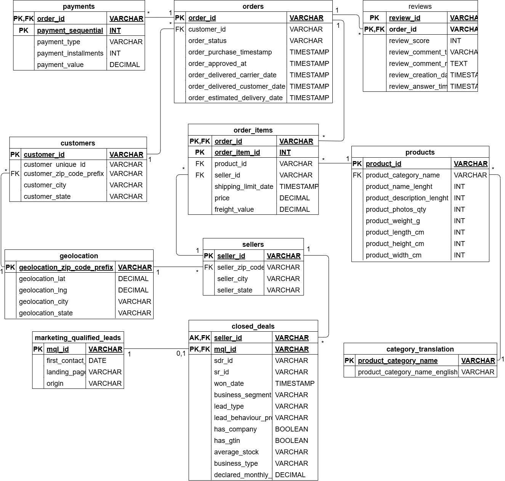
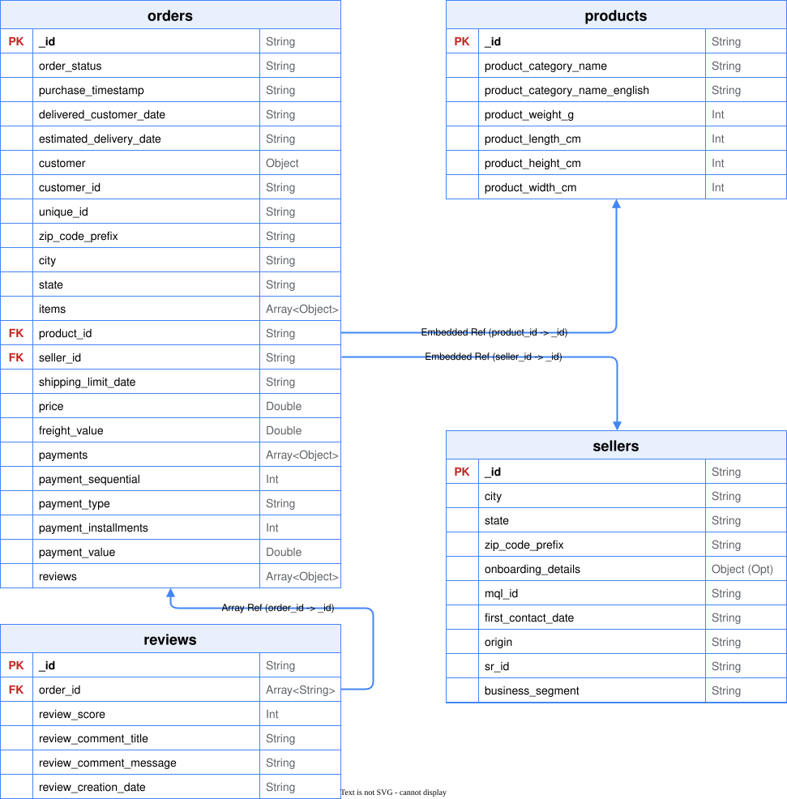

# Olist E-Commerce NoSQL Project

This project is part of the **Advanced Database Technologies (NoSQL)** course at Ben-Gurion University. The goal of this project is to model, ingest, and analyze the Brazilian E-Commerce Public Dataset by Olist, along with its Marketing Funnel extension.

---


* **Brazilian E-Commerce Public Dataset by Olist**: [https://www.kaggle.com/datasets/olistbr/brazilian-ecommerce](https://www.kaggle.com/datasets/olistbr/brazilian-ecommerce)
* **Marketing Funnel by Olist**: [https://www.kaggle.com/datasets/olistbr/marketing-funnel-olist](https://www.kaggle.com/datasets/olistbr/marketing-funnel-olist)

---

## Project Phases & Development

### Phase 1: Relational Modeling 
In the first phase, we established a solid relational foundation:
- Downloaded the raw datasets using the Kaggle API.
- Designed an Entity-Relationship Diagram (ERD) encompassing 11 tables.

#### ERD Diagram
[](https://viewer.diagrams.net/?url=https://raw.githubusercontent.com/netanelr6/nosql-olist-project/main/diagrams/OlistERD.drawio)

[👁️ View Relational Diagram](https://viewer.diagrams.net/?url=https://raw.githubusercontent.com/netanelr6/nosql-olist-project/main/diagrams/OlistERD.drawio) | [✏️ Edit Relational Diagram](https://app.diagrams.net/#Hnetanelr6%2Fnosql-olist-project%2Fmain%2Fdiagrams%2FOlistERD.drawio)

### Phase 2: SQL DB (PostgreSQL)
- Implemented the operational database schema in PostgreSQL.
- Linked the E-commerce operational data with the Marketing Funnel data (connecting `closed_deals` to `sellers`).

### Phase 3: NoSQL Document Store (MongoDB)
- Designed an embedded document schema containing 4 collections: `orders`, `sellers`, `products`, and `reviews`.
- Programmed a Python-based pipeline that reads the SQL database, denormalizes the relations, embeds relevant items, and populates MongoDB.

#### NoSQL ERD Diagram
[](https://viewer.diagrams.net/?url=https://raw.githubusercontent.com/netanelr6/nosql-olist-project/main/diagrams/OlistNoSQLERD.drawio)

[👁️ View NoSQL Diagram](https://viewer.diagrams.net/?url=https://raw.githubusercontent.com/netanelr6/nosql-olist-project/main/diagrams/OlistNoSQLERD.drawio) | [✏️ Edit NoSQL Diagram](https://app.diagrams.net/#Hnetanelr6%2Fnosql-olist-project%2Fmain%2Fdiagrams%2FOlistNoSQLERD.drawio)

---

## Docker Architecture

The system runs entirely within **Docker** and consists of the following services:
1. **PostgreSQL** (`olist_postgres`): The relational operational database.
2. **pgAdmin 4** (`olist_pgadmin`): Web GUI for PostgreSQL administration (available at http://localhost:8082).
3. **MongoDB** (`olist_mongodb`): The analytical document database.
4. **Mongo Express** (`olist_mongo_express`): Web GUI for MongoDB administration (available at http://localhost:8081).
5. **ETL Container** (`olist_etl`): A Python environment that automates:
   - Downloading dataset files from Kaggle.
   - Bulk-loading relational CSV data to PostgreSQL.
   - Restructuring relational rows into smart, nested, denormalized documents in MongoDB.

---

## Database Access & Web Interfaces

Once Docker Compose is running, you can inspect and query both databases using either the web management tools or external SQL/NoSQL clients:

### 🐘 1. PostgreSQL (Relational Operational DB)
* **Web GUI (pgAdmin 4)**: [http://localhost:8082](http://localhost:8082)
  * Runs in **Desktop Mode** (zero login screens or master passwords required).
  * The connection to the Olist database is pre-configured and auto-connected under the "Servers" tab as **"Olist Local Postgres"** (no setup or typing required).
* **External Client (DBeaver, DataGrip, pgAdmin, VS Code)**:
  * **Host**: `localhost`
  * **Port**: `5432`
  * **Username**: `admin`
  * **Password**: `pass`
  * **Database**: `olist_sql`

### 🍃 2. MongoDB (Analytical Document DB)
* **Web GUI (Mongo Express)**: [http://localhost:8081](http://localhost:8081)
  * Accessible directly without authentication (for local development).
* **External Client (MongoDB Compass)**:
  * **Connection URI**: `mongodb://localhost:27017/`
  * **Database**: `olist_db`

---

## Repository Structure

```
nosql-olist-project/
│
├── docker-compose.yml       # Orchestrates all containers and database health checks
├── requirements.txt         # Python libraries for the ETL container
├── .gitignore               # Excludes data files, secrets, and local db volumes
├── .env.example             # Template for Kaggle API credentials
├── README.md                # This setup guide
│
├── db_data/                 # PERSISTENT STORAGE (Git-ignored)
│   ├── postgres/            # Relational database files
│   └── mongodb/             # Document database files
│
├── src/                     # Python Source Code
│   ├── main_pipeline.py     # Main orchestrator (Download -> SQL -> MongoDB)
│   ├── download_data.py     # Kaggle data API download script
│   ├── load_to_sql.py       # PostgreSQL schema builder and bulk loader
│   ├── load_to_mongo.py     # MongoDB document schema builder and denormalizer
│   └── verify.py            # Automated SQL and MongoDB ingestion test
│
├── docker/                  
│   └── Dockerfile.etl       # Python ETL container definition
│
└── data/                    # Kaggle CSV folder (Git-ignored, mapped to host)
```

---

## Setup & Quick-Start (One-Click Launch)

Follow these steps to run the entire pipeline from scratch.

### 1. Kaggle API Credentials Configuration
To download the datasets automatically, you need a Kaggle API token:
1. Go to your [Kaggle Account Settings](https://www.kaggle.com/settings) and click **"Create New Token"**.
2. A file named `kaggle.json` containing your username and key will be downloaded.
3. Copy **`.env.example`** to **`.env`** in the project root:
   ```bash
   cp .env.example .env
   ```
4. Fill in the variables using the values inside your `kaggle.json`:
   ```env
   KAGGLE_USERNAME=your_kaggle_username
   KAGGLE_KEY=your_kaggle_api_key
   ```
   > **Note**: Database passwords/ports are pre-configured in `docker-compose.yml` for zero-setup convenience.

### 2. Run the Pipeline

#### Option A: Windows One-Click Script (Recommended)
Simply double-click the **`run_project.bat`** file in the root folder, or run it from the command line:
```cmd
run_project.bat
```
This script automates building the containers, starting the databases, tracking the ETL logs in real-time, and executing the verification checks automatically.

#### Option B: Standard Terminal Commands
Start the containers. Docker Compose will automatically wait for the databases to be healthy before starting the ETL pipeline:
```bash
docker compose up --build -d
```

### 3. Monitor Execution Logs
Watch the progress of the data download, PostgreSQL bulk ingestion, and MongoDB denormalization:
```bash
docker compose logs -f etl
```
Once the ETL process is completed successfully, the `olist_etl` container will print:
`=== ETL Pipeline Execution Completed Successfully ===` and exit.

---

## Verification & Sanity Checks

Verify that both databases contain the correct amount of records by executing the validation script inside the ETL container:
```bash
docker compose run --rm etl python src/verify.py
```

**Expected Count Output:**
```
Found 11 tables in SQL database:
 - Table 'olist_closed_deals_dataset': 842 rows
 - Table 'olist_customers_dataset': 99441 rows
 - Table 'olist_geolocation_dataset': 1000163 rows
 - Table 'olist_marketing_qualified_leads_dataset': 8000 rows
 - Table 'olist_order_items_dataset': 112650 rows
 - Table 'olist_order_payments_dataset': 103886 rows
 - Table 'olist_order_reviews_dataset': 99224 rows
 - Table 'olist_orders_dataset': 99441 rows
 - Table 'olist_products_dataset': 32951 rows
 - Table 'olist_sellers_dataset': 3095 rows
 - Table 'product_category_name_translation': 71 rows
Found 4 collections in MongoDB:
 - Collection 'orders': 99441 documents
 - Collection 'products': 32951 documents
 - Collection 'reviews': 98410 documents
 - Collection 'sellers': 3095 documents
=== Verification Complete: All systems operational ===
```

---

## Homework 2 Answers

The requested exercises for HW2 have been prepared as dedicated analysis documents:
* **Task 4: Aggregation Pipelines** - [mongo_aggregations.md](./docs/mongo_aggregations.md)
  - Detailed translation and explanation of the five complex SQL queries into MongoDB shell aggregations.
* **Task 5: Big Data V's Analysis** - [big_data_vs_analysis.md](./docs/big_data_vs_analysis.md)
  - Theoretical analysis of Volume, Velocity, Variety, Veracity, Value, and Variability inside Olist's ecosystem.